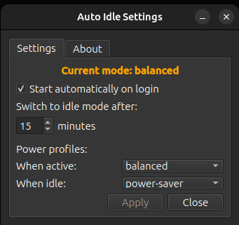
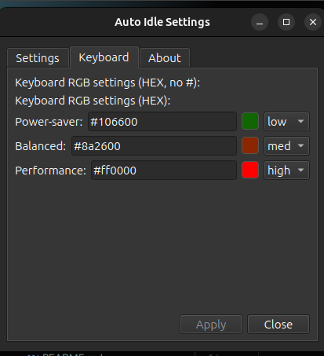
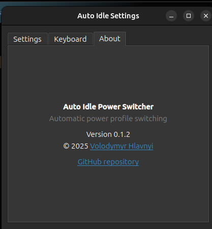

# Auto Idle Power Switcher

A lightweight GNOME tray application for Ubuntu that automatically switches
power profiles based on user idle time.

## Features

- Automatic power profile switching based on idle time
- GNOME tray icon with live status
- Manual override detection (syncs with system power settings)
- Configurable idle timeout
- Autostart toggle
- Clean uninstall
- Native `.deb` installer for Ubuntu 24.04

### Keyboard RGB (ASUS laptops)

Auto Idle Power Switcher can optionally synchronize ASUS keyboard RGB lighting
with the active power profile using **asusctl**.
Asus ROG laptops with RGB keyboards are supported (G814JIR tested).

When enabled:

- **Power-saver** → Green (low brightness)
- **Balanced** → Yellow / orange (medium brightness)
- **Performance** → Red (high brightness)

Colors and brightness levels are fully configurable from the **Keyboard** tab
in the settings window.

If `asusctl` is not installed or the system is not an ASUS laptop, the Keyboard
tab will display an informational message and RGB controls will be disabled
automatically.

## Screenshots

### Tray icon and status


### Settings window



### Keyboard (RGB)



### About tab



## Installation

Download the latest `.deb` from **GitHub Releases** and install:

```bash
sudo dpkg -i auto-idle_0.1.0.deb
sudo apt -f install
```

## Usage

Launch from Applications menu or run:

```bash
auto-idle
```

## Settings are available from the tray icon.

Requirements

- Ubuntu 24.04 (GNOME, Wayland)
- power-profiles-daemon

## Author

Volodymyr Hlavnyi (2025)
https://github.com/volodymyr-hlavnyi

## License

MIT
